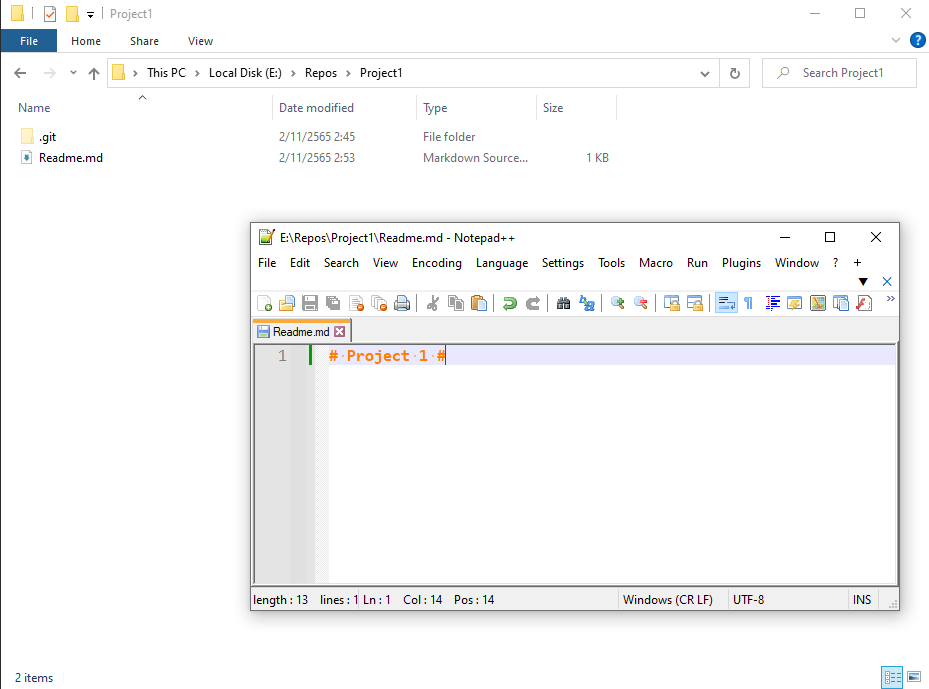
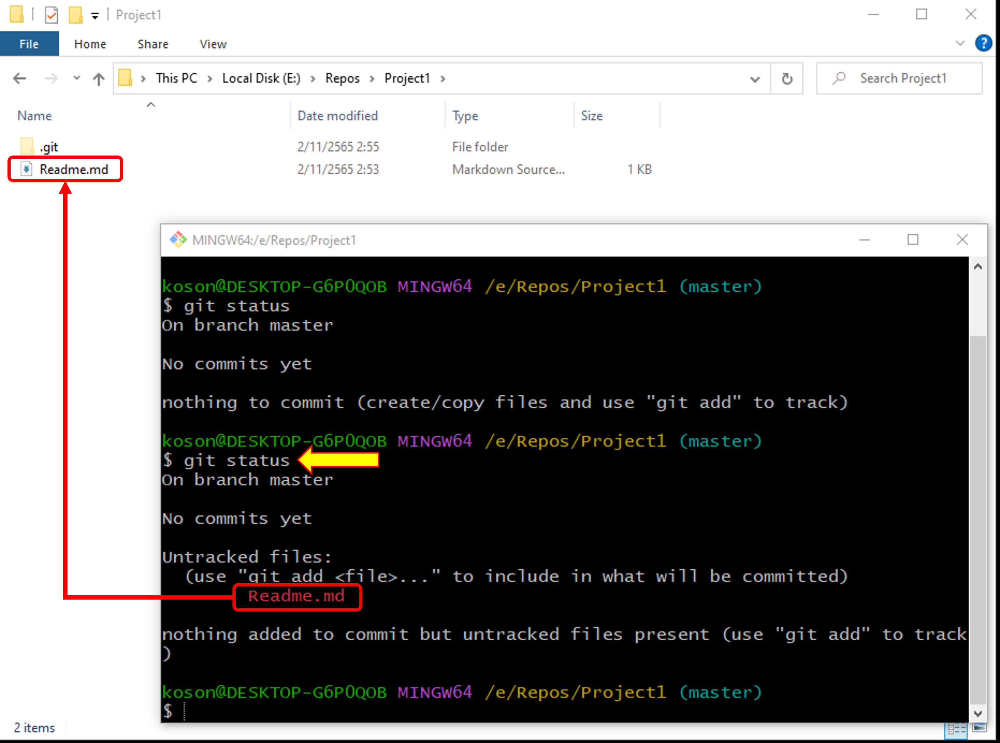

# การทำงานด้วย git bash (command line terminal) #

1. เรียกโปรแกรม git bash
-  ถ้ายังไม่ติดตั้งหรือสามารถทำตามขั้นตอนได้ในใบงานนี้ <https://github.com/COM-LAB-I-2565/COM-LAB-I-Week-09>

2. เรียกโปรแกรม git bash
- โดยปกติ เมื่อเรียก git bash ขึ้นมา โปรแกรมจะพาเราไปทำงานที่ไดเรกตอรี่ home ของ user ซึ่งอาจจะไม่สะดวกในการทำงาน
- วิธีที่ง่ายคือการเรียกจาก file browser ตามขั้นตอนในรูปที่ 1

<p align="center">

</p>

<p align ="Center"> <b>รูปที่ 1</b> การเรียก git bash จาก working directory</p>

2.1 เปิด file browser  
2.2 สร้าง working directory ชื่อ `Project1`  
2.3 คลิกขวาในบริเวณที่ว่างของ file browser  
2.4 คลิกตัวเลือก `Git Bash Here` (ถ้าไม่มี ให้ลองกดปุ่ม shift ก่อนคลิกเมาส์ขวา)  

โปรแกรม git bash จะถูกเรียกขึ้นมา โดยมี working directory อยู่ที่เดียวกันกับ folder ใน file browser


<p align="center">

</p>

<p align ="Center"> <b>รูปที่ 2</b> หน้าต่าง git bash </p>

3. สร้าง git repository ด้วย git bash

เราสามารถใช้ git bash สร้าง repository ได้ด้วยคำสั่ง `git init` ซึ่งจะเป็นการสร้าง directory ที่ชื่อ `.git` ขึ้นใน working directory ไว้เป็นที่จัดเก็บและติดตามการแก้ไขงานต่าง ๆ โดย directory ที่ชื่อ  `.git ` นี้จะมีลักษณะ (Attribute) เป็น hidden หมายความว่าปกติเราจะมองไม่เห็น จนกว่าจะสั่งให้ file browser แสดงไฟล์หรือโฟลเดอร์ที่ซ่อนไว้

3.1 พิมพ์คำสั่ง `git init` ใน git bash ดังรูปที่ 3

<p align="center">

</p>

<p align ="Center"> <b>รูปที่ 3</b> พิมพ์คำสั่ง `git init` </p>

[1] พิมพ์คำสั่ง `git init`  
[2] จะเห็นโฟลเดอร์ชื่อ `.git` ถูกสร้างขึ้นมา  

--- 

ถ้าไม่เห็นโฟลเดอร์ชื่อ `.git` ให้ตั้งค่าการแสดงผลของ file browser ตามขั้นตอนในรูปที่ 4

<p align="center">

</p>

<p align ="Center"> <b>รูปที่ 4</b> การตั้งค่าให้ file browser แสดง hidden items</p>

**นักศึกษาสามารถเข้าไปดูรายละเอียดในโฟลเดอร์ได้ แต่รายละเอียดเหล่านั้นอยู่นอกขอบเขตของใบงานนี้**

--- 

3.1 พิมพ์คำสั่ง `git status` ใน git bash เพื่อตรวจสอบสถานะการทำงานของ git


<p align="center">

</p>

<p align ="Center"> <b>รูปที่ 5</b> ผลจากการทำคำสั่ง git status </p>


3.2 สร้างไฟล์ใหม่ ชื่อ Readme.md โดยมีเนื้อหาในไฟล์ดังรูปที่ 6
3.3 บันทึกไฟล์ให้เรียบร้อย

<p align="center">

</p>

<p align ="Center"> <b>รูปที่ 6</b> สร้างไฟล์ใหม่ชื่อ Readme.md </p>


3.4 พิมพ์คำสั่ง `git status` ใน git bash เพื่อตรวจสอบสถานะการทำงานของ git

<p align="center">

</p>

<p align ="Center"> <b>รูปที่ 7</b> ผลจากการทำคำสั่ง git status </p>

git จะเฝ้าดูการเปลี่ยนแปลงของไฟล์ต่าง ๆ ใน working directory
เมื่อเราสร้างไฟล์ใหม่ (`Readme.md`) ขึ้นใน folder นี้
git จะตรวจพบและรู้ว่าเป็นไฟล์ใหม่ ซึ่ง git ไม่เคยติดตามการเปลี่ยนแปลงมาก่อน (untracked)

เพื่อบอกให้ git เก็บเนื้อหาของไฟล์เข้าไปใน repository
และติดตามการเปลี่ยนแปลงของไฟล์ เราต้องใช้คำสั่ง `git add` โดยมีรูปแบบดังนี้

``` git
    git add <filename>  // add ไฟล์ที่ชื่อ filename เพื่อให้ git ทำการติดตาม 
    git add .           // add ไฟล์ทั้งโฟลเดอร์เพื่อให้ git ทำการติดตาม 
```

3.5 พิมพ์คำสั่ง `git add Readme.md` ใน git bash เพื่อให้ git ได้เพิ่ม Readme.md เข้าไปใน repository


3.6 พิมพ์คำสั่ง `git status` ใน git bash เพื่อตรวจสอบสถานะการทำงานของ git

<p align="center">

</p>

<p align ="Center"> <b>รูปที่ 7</b> ผลจากการทำคำสั่ง git add... และ git status</p>