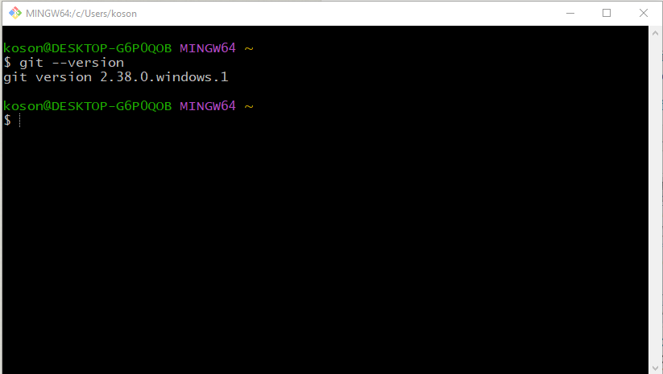
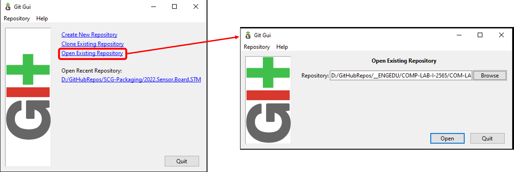
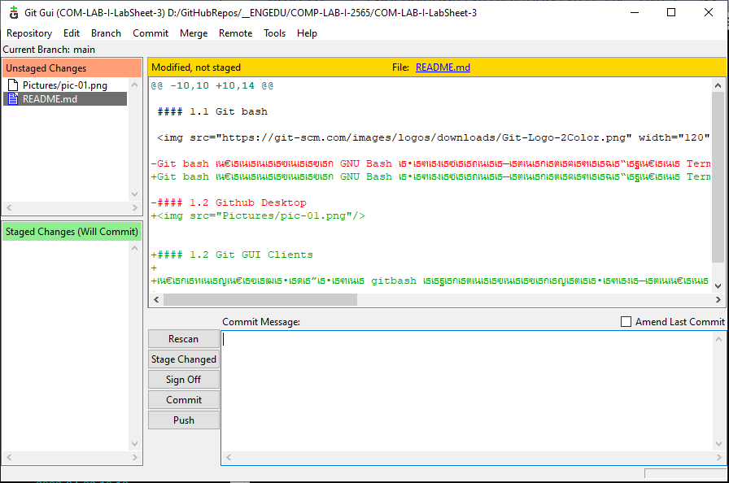
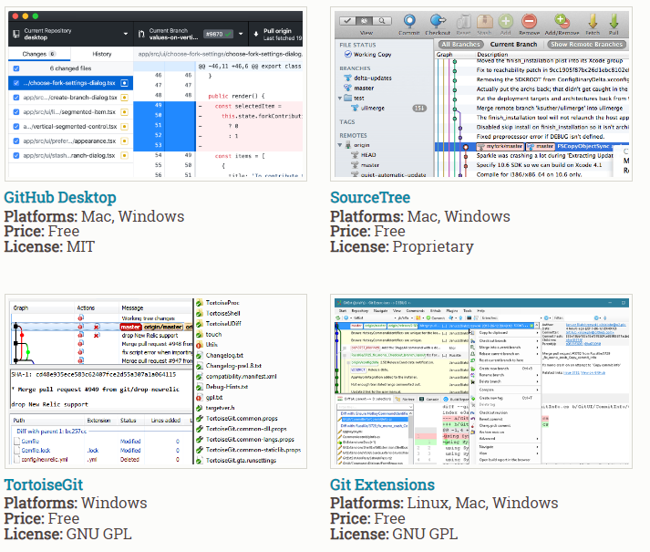

# ใบงานที่ 4 การใช้งาน git clients

## 1. แนะนำใบงาน

ใบงานนี้จะพานักศึกษามาทำความรู้จักกับ git clients ซึ่งจะใช้ระบบปฏิบัติการ Windows 10-11 เป็นหลัก นักศึกษาที่ใช้ OS อื่นๆ สามารถนำแนวทางไปใช้ได้ตามลักษณะเฉพาะของ OS นั้นๆ

เนื่องจาก git เป็นโปรแกรมควบคุมรุ่นที่ยิยมใช้อย่างแพร่หลาย จึงมี git client ให้เลือกใช้ได้หลายตัว ขึ้นอยู่กับลักษณะของงานและการแก้ปัญหาที่เกิดขึ้นเฉพาะหน้า เนื่องจาก git client แต่ละตัวจะมีความสามารถที่แตกต่างกันไป

ถ้าแบ่งตามประเภทในการใช้งาน เราจะพบว่า git client มี 2 พวกใหญ่ๆ คือ

1. git client แบบ stand alone  
1.1 git client ชนิด terminal เช่น git bash หรือ terminal ของ OS ต่าง ๆ  
1.2  git client ชนิด GUI เช่น github desktop และอื่น ๆ  
2. git client ที่ผนวกเข้ากับ IDE  เช่น Visual studio, visual studio Code, Eclipse เป็นต้น  

### 1. Git Clients แบบ stand alone

#### 1.1 Git bash หรือ terminal based (เช่นใน Unix, Linux, MacOS)

Git bash เป็นโปรแกรม GNU Bash ตัวหนึ่งที่มีลักษณะเป็น Terminal ที่รองรับคำสั่ง git มีให้ใช้ทั้งบน Windows, macOS และ Linux/Unix  ดูรายละเอียดได้จาก <https://git-scm.com/>

 <b>รูปที่ 1</b> โปรแกรม git bash 

ถึงแม้ผู้พัฒนาตั้งใจสร้าง git bash เพื่อให้ทำงานเป็น commanf line tool แต่ก็ได้ผนวกเอา Application ที่เป็น GUI ติดมาด้วย (ชื่อว่า Git GUI) โดยจะมีส่วนติดต่อผู้ใช้แบบกราฟฟิกส์ สำหรับการ commit, push, pull และอื่น ๆ  

__ตัวอย่างโปรแกรม git GUI__

1.เรียกโปรแกรม git GUI และเปิด repository ที่เคยได้ clone ไว้ใน harddisk

 <b>รูปที่ 2</b> โปรแกรม git Gui (เปิด repository ใน harddisk)

2.ลักษณะของโปรแกรม git GUI ที่มาพร้อมกับ git bash

 <b>รูปที่ 1</b> ลักษณะของโปรแกรม git GUI 

นอกจาก git GUI แล้วยังมีโปรแกรม git GUI Clients อีกหลายตัว ทั้งชนิดที่ฟรีและมีค่าใช้จ่ายสำหรับหารซื้อ License 

#### 1.2 Git GUI Clients ####

ถึงแม้ว่า Git จะมาพร้อมกับเครื่องมือ GUI ในตัว สำหรับใช้ในการทำงานต่างๆ กับฝั่ง local และ  remote  (git-gui)  แต่มีเครื่องมือของผู้พัฒนารายอื่น หลายเจ้า สำหรับให้เลือกใช้ตามลักษณะงานและ operating system หรือ platform  ดังรูปที่ 4

 <b>รูปที่ 1</b> ตัวอย่างเครื่องมือ git gui ของผู้พัฒนารายอื่น

(ดูรายละเอียดได้ที่ <https://git-scm.com/downloads/guis> และ <https://git.wiki.kernel.org/index.php/InterfacesFrontendsAndTools>)
